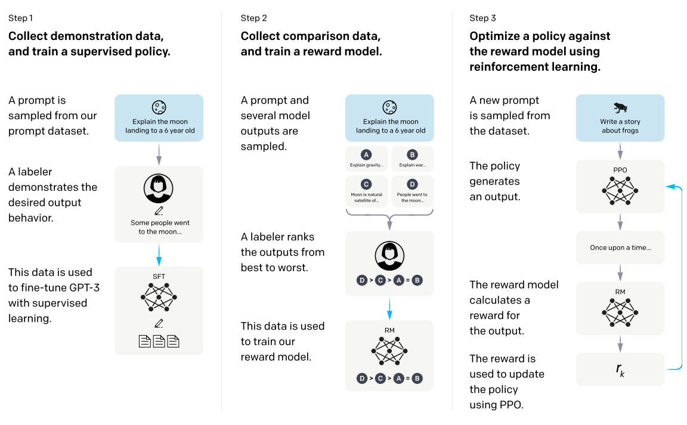
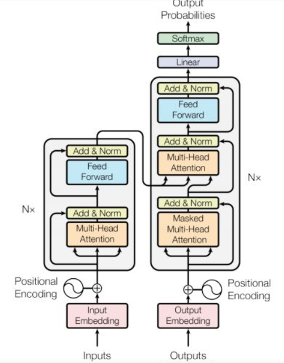
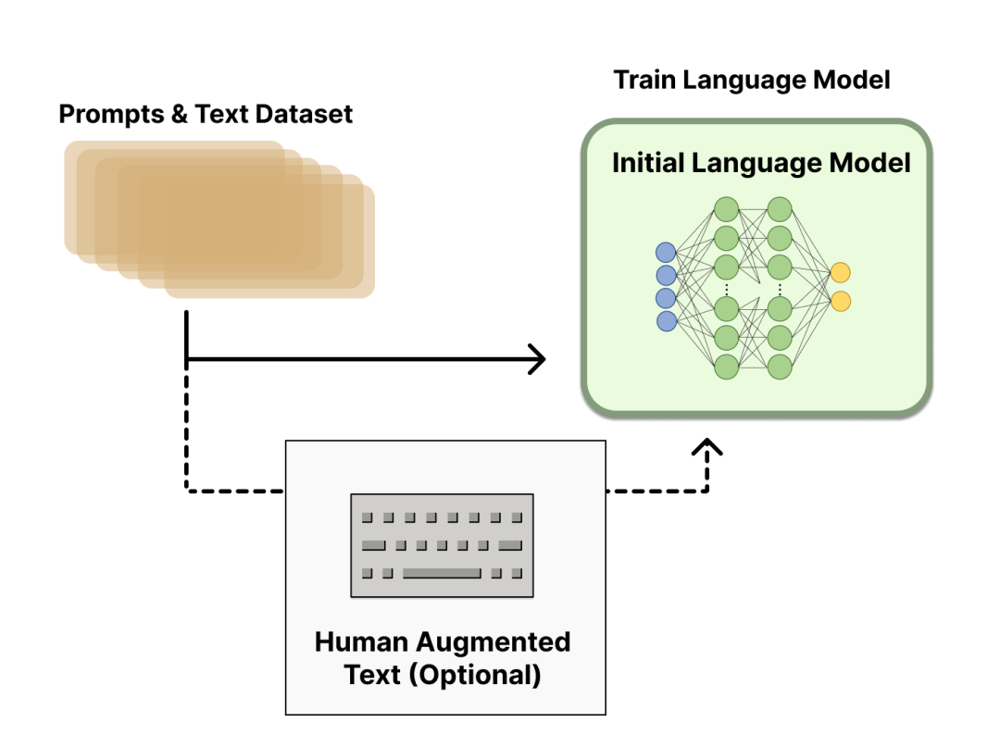
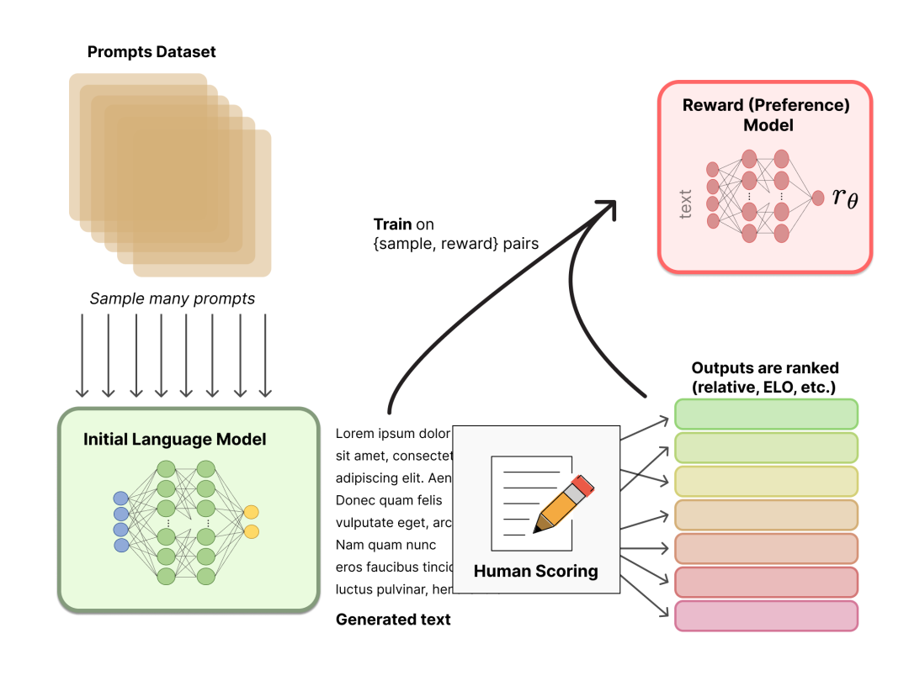
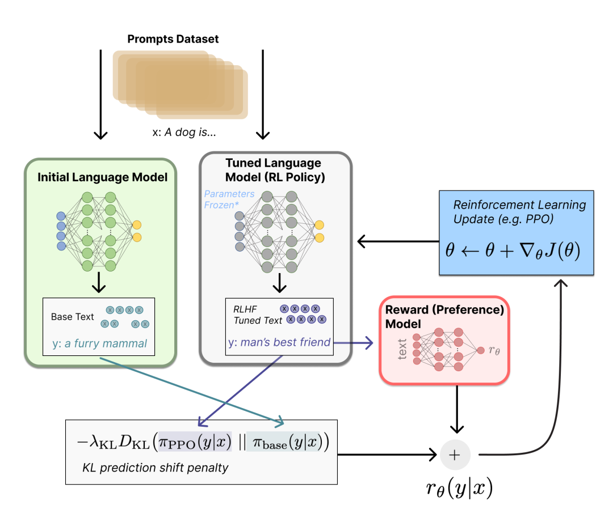

# 通俗易懂的ChatGPT的原理简介

 ChatGPT是一种基于自然语言处理技术的对话生成模型，它通过学习大量的语言数据和预测下一个单词的能力，可以自动地生成人类可读的自然语言文本，从而实现自然、流畅的对话生成。在本文中，我们将深入介绍ChatGPT的原理、应用场景以及优势等方面，让大家对ChatGPT有一个更加全面和深入的了解。

# 一、什么是ChatGPT

​    ChatGPT是一种基于Transformer架构和无监督预训练技术的对话生成模型。它是由OpenAI公司推出的一款人工智能技术，具有自然语言理解、文本生成、对话生成等功能，可以实现自动回复、聊天机器人、智能语音助手、知识问答系统、自然语言生成等应用。

​    与传统的对话系统不同，ChatGPT采用了深度学习技术，可以自动地从大量的语言数据中学习到语言的规律和特征，从而实现更加自然、流畅的对话生成。目前，ChatGPT的最新版本是GPT-3，它的模型参数数量达到了175亿个，是目前最大的对话生成模型之一。

# 二、ChatGPT的原理

​    ChatGPT的原理基于GPT模型结构、无监督预训练技术、微调技术、奖励模型、人类反馈的强化学习模型 等技术，下面我们将对这些技术进行详细介绍。

## GPT模型结构

​    GPT模型结构是ChatGPT的基础，它采用了Transformer架构，其中包括了多头自注意力机制、残差连接、层归一化等技术。Transformer架构的优点是能够处理任意长度的序列数据，从而适用于自然语言处理领域。

##    2.无监督预训练技术

​    无监督预训练技术是ChatGPT实现对话生成的关键技术，它可以自动地从大量的无标注数据中学习到语言的规律和特征，从而提高模型的泛化能力和表现力。

​    无监督预训练技术分为两个阶段，分别是语言模型预训练和掩码语言模型预训练。语言模型预训练的目标是预测下一个单词的概率，掩码语言模型预训练的目标是根据输入的部分文本预测掩码位置上的单词。通过这两个阶段的预训练，模型可以学习到词汇、语法、语义等语言的基本规律，从而在后续的微调阶段中更加准确地预测和生成自然语言文本。

##    3.微调技术

​    微调技术是ChatGPT实现对话生成的关键技术之一，它可以通过在有标注数据上进行有监督训练，从而使模型适应特定任务和场景。微调技术通常采用基于梯度下降的优化算法，不断地调整模型的权重和偏置，以最小化损失函数，从而提高模型的表现能力。

##    4.奖励模型的训练

一个奖励模型（RM）的目标是刻画模型的输出是否在人类看来表现不错。即，输入 [提示(prompt)，模型生成的文本] ，输出一个刻画文本质量的标量数字。

用于训练奖励模型的Prompt数据一般来自于一个预先富集的数据集，比如Anthropic的Prompt数据主要来自Amazon Mechanical Turk上面的一个聊天工具；OpenAI的Prompt数据则主要来自那些调用GPT API的用户。这些prompts会被丢进初始的语言模型（第一阶段的模型）里来生成文本。

奖励模型可以看做一个判别式的语言模型，因此我们可以用一个预训练语言模型热启，而后在 [x=[prompt，模型回答], y=人类满意度] 构成的标注语料上去微调，也可以直接随机初始化，在语料上直接训练。

##    5.基于 RL 进行语言模型优化 

​    我们将初始语言模型的微调任务建模为强化学习（RL）问题，因此需要定义策略（policy）、动作空间（action space）和奖励函数（reward function）等基本要素。

​    显然，策略就是基于该语言模型，接收prompt作为输入，然后输出一系列文本（或文本的概率分布）；而动作空间就是词表所有token在所有输出位置的排列组合（单个位置通常有50k左右的token候选）；观察空间则是可能的输入token序列（即prompt），显然也相当大，为词表所有token在所有输入位置的排列组合；而奖励函数则是基于上一章节我们训好的RM模型，配合一些策略层面的约束进行的奖励计算。

​    然后我们来看一下具体怎么计算得到奖励（reward）。

​    首先，基于前面提到的预先富集的数据，从里面采样prompt输入，同时丢给初始的语言模型和我们当前训练中的语言模型（policy），得到俩模型的输出文本y1，y2。然后用奖励模型RM对y1、y2打分，判断谁更优秀。显然，打分的差值便可以作为训练策略模型参数的信号，这个信号一般通过KL散度来计算“奖励/惩罚”的大小。显然，y2文本的打分比y1高的越多，奖励就越大，反之惩罚则越大。这个reward信号就反映了文本整体的生成质量。

​    有了这个reward，便可以根据 Proximal Policy Optimization (PPO) 算法来更新模型参数了。

​    该阶段流程如下图所示：

# 三、ChatGPT的应用场景

​    ChatGPT的应用场景非常广泛，包括客户服务、聊天机器人、智能语音助手、知识问答系统、自然语言生成等方面。下面我们将对这些应用场景进行详细介绍。

# 客户服务

​    ChatGPT可以用于客户服务领域，通过对话生成技术实现智能客服，自动回答客户提问，提高客户满意度和服务质量。例如，许多企业采用ChatGPT技术实现自动化客服，在客户提出问题后，ChatGPT可以自动地生成回答，从而实现快速响应和解决问题的目的。

##    2.聊天机器人

​    ChatGPT可以用于聊天机器人领域，通过对话生成技术实现人机对话，与用户进行自然、流畅的对话。例如，微软的小冰就是一款基于ChatGPT技术的聊天机器人，它可以与用户进行语音或文字对话，实现自然、流畅的人机交互。

##     3.智能语音助手

​    ChatGPT可以用于智能语音助手领域，通过对话生成技术实现智能语音交互。例如，苹果的Siri、谷歌的Google Assistant、亚马逊的Alexa等智能语音助手都采用了ChatGPT技术，可以与用户进行自然、流畅的语音对话，实现更加便捷的智能化服务。

##     4.知识问答系统

​    ChatGPT可以用于知识问答系统领域，通过对话生成技术实现对用户提出的问题进行自动回答。例如，百度知道、搜狗问问等知识问答平台就采用了ChatGPT技术，可以通过输入问题，自动返回相关的答案，实现更加便捷的知识获取和分享。

##     5.自然语言生成

​    ChatGPT可以用于自然语言生成领域，通过对话生成技术实现自然语言文本的生成。例如，在文本生成领域，可以通过输入少量的文本，让ChatGPT生成符合用户要求的文本。这种技术可以应用于文本摘要、文章生成、自动翻译、情感分析等方面。

# 四、ChatGPT的发展趋势

​    ChatGPT作为自然语言处理领域的重要技术之一，在未来的发展中具有非常广阔的前景。下面我们将对ChatGPT的发展趋势进行详细介绍。

## 模型的优化和改进

随着计算机技术和深度学习算法的不断发展，ChatGPT的模型结构和算法也将不断进行优化和改进。例如，可以通过改进模型结构、增加数据训练集、优化超参数等方式，进一步提高模型的性能和表现能力。

##    2.跨语言对话生成

目前，ChatGPT主要支持英语和中文等语言的对话生成，未来将会进一步扩展到其他语言领域，实现更加全球化的自然语言处理服务。例如，可以通过增加训练数据、设计跨语言模型结构等方式，实现跨语言对话生成的目标。

##    3.多模态对话生成

​    多模态对话生成是指在自然语言处理中同时考虑图像、视频、音频等多种模态信息，实现更加丰富和复杂的对话生成。ChatGPT未来也将会发展到多模态对话生成领域，通过整合多种模态信息，实现更加真实、自然的对话生成。

##    4.强化学习的应用

​    强化学习是一种通过与环境进行交互，从而最大化累积奖励的机器学习方法。在ChatGPT中，可以将强化学习应用于对话生成中，通过不断与用户进行交互，从而优化模型的表现能力和生成效果。

# 五、结语

​    ChatGPT作为自然语言处理领域的重要技术之一，具有非常广泛的应用前景和发展潜力。通过对话生成技术，可以实现智能客服、知识问答系统、自然语言生成等多种应用场景，大大提高了人机交互的效率和便利性。随着计算机技术的不断发展和深度学习算法的不断进步，ChatGPT的应用领域也将不断扩展和深化，为人们提供更加先进、高效、智能的自然语言处理服务。

​    当然，在ChatGPT的发展过程中也会面临一些挑战和问题，例如模型的过拟合、数据的质量和数量等方面，需要不断进行优化和改进。同时，ChatGPT的应用也需要遵守相应的法律和道德规范，保证对用户和社会的影响是积极的、有益的。

​    在未来的发展中，ChatGPT有望成为自然语言处理领域的一项重要技术，为人们提供更加智能化和高效化的自然语言处理服务，实现人机交互的更加智能、自然和人性化。